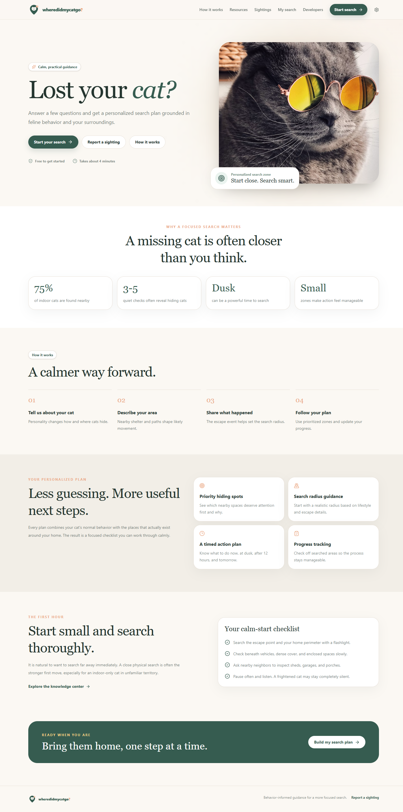
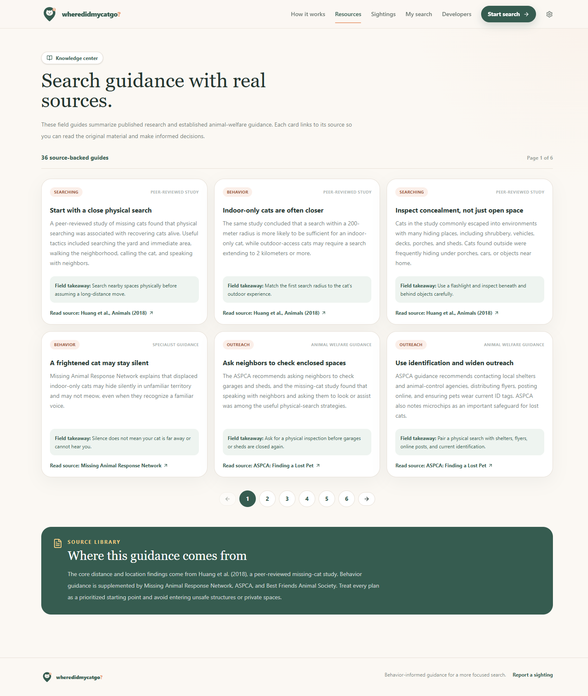
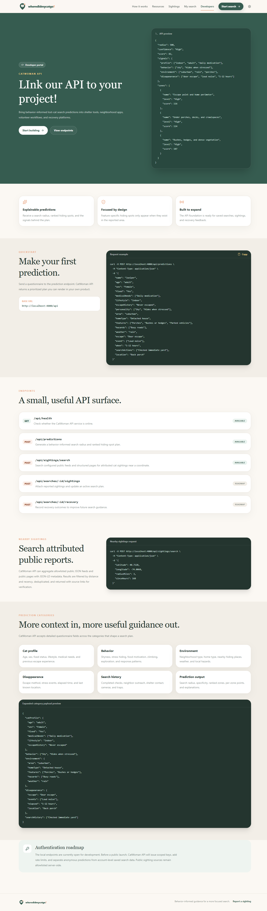

# wheredidmycatgo?

A calm, behavior-informed lost cat search assistant. It turns details about a missing cat into a practical search plan, helps neighbors share sightings, and keeps a durable record of community updates.

## Preview

### Search guidance



### Credible-source knowledge center



### CatWoman API developer portal



## Features

- Guided lost-cat intake and evidence-informed hiding-spot predictions
- Interactive search dashboard with prioritized zones and a timed checklist
- Mobile-friendly community sighting reports and saved sighting history
- Public neighborhood search page and printable flyer
- Knowledge center with credible external sources
- CatWoman API developer portal and nearby public-source sighting search
- Local frontend fallback when the API is unavailable

## Run locally

Clone the repository and install dependencies:

```bash
git clone https://github.com/theworker02/solid-succotash.git
cd solid-succotash
npm install
npm run dev
```

This starts the frontend at `http://localhost:5173` and the API at `http://localhost:4000`.

```bash
npm test
npm run build
```

## Documentation

- [Documentation index](docs/README.md)
- [Architecture](docs/architecture.md)
- [API reference](docs/api.md)
- [Prediction engine](docs/prediction-engine.md)
- [Local development](docs/development.md)
- [Deployment](docs/deployment.md)
- [Database schema](docs/database-schema.md)

## Structure

- `frontend/` React, Vite, Tailwind, and the browser experience
- `backend/` Express API, saved sighting records, and public-source search
- `shared/` deterministic prediction engine shared by frontend and backend
- `docs/` technical and product documentation

## Product routes

- `/` landing page and product explanation
- `/start` three-step prediction wizard
- `/dashboard` generated search plan and progress tracking
- `/public-search` shareable neighborhood search page
- `/flyer` printable lost-cat flyer
- `/sightings` mobile-friendly community sighting and update board
- `/sightings/history` saved sighting archive and filters
- `/settings` search, notification, privacy, and API preferences
- `/resources` knowledge center
- `/how-it-works` methodology overview
- `/developers` CatWoman API developer portal

## Stack

React, TypeScript, Vite, Tailwind CSS, React Router, Framer Motion, and Lucide icons.

The frontend calls `POST /api/predictions` and falls back to a local deterministic engine when the API is offline. Answers and plans are stored in browser storage so the core journey remains usable during local frontend-only development. See [CONTRIBUTING.md](CONTRIBUTING.md) before opening a pull request and [SECURITY.md](SECURITY.md) for responsible disclosure.

## License

Licensed under the [Apache License 2.0](LICENSE).
